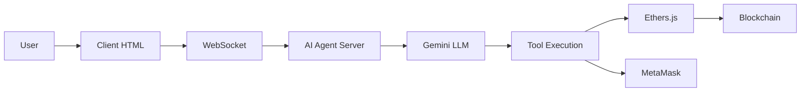
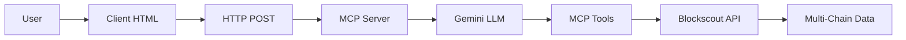

# 🤖 Dual Mode Vault AI Agent

## Overview

The Vault AI Agent now supports **two distinct modes** for different use cases:

1. **🤖 Agent Mode** - Smart contract trading with MetaMask
2. **🔍 Query Mode** - Multi-chain blockchain analysis via MCP server

---

## 🤖 Agent Mode

### Purpose
Interactive trading agent for the Vault smart contract with MetaMask integration.

### Features
- ✅ Real-time token price queries
- ✅ Buy/sell cost calculations
- ✅ Transaction preparation with MetaMask signing
- ✅ Direct blockchain interactions via ethers.js
- ✅ LLM-powered natural language understanding

### How It Works
```
User → AI Agent (port 3002) → LLM (Gemini 2.0 Flash) → Tools → Blockchain
                                                              ↓
                                                         MetaMask
```

### Example Queries
```
"What is the current price of Tesla token?"
"How much will it cost to buy 5 Tesla tokens?"
"Buy 5 Tesla tokens"
"Sell 3 Tesla tokens"
```

### Technical Details
- **Server**: `vault-ai-server.ts` (port 3002)
- **Agent**: `vault-ai-agent.ts`
- **Protocol**: WebSocket
- **LLM**: Gemini 2.0 Flash with tool calling
- **Tools**: 
  - `get_token_price`
  - `calculate_buy_cost`
  - `calculate_sell_return`
  - `prepare_buy_transaction`
  - `prepare_sell_transaction`

---

## 🔍 Query Mode

### Purpose
Comprehensive blockchain analysis across multiple chains using the MCP server.

### Features
- ✅ Multi-chain support (Ethereum, Sepolia, Base Sepolia, Optimism, Arbitrum)
- ✅ Transaction history analysis
- ✅ Gas spend calculations
- ✅ Token holdings across chains
- ✅ Contract security analysis
- ✅ Cross-chain activity comparison

### How It Works
```
User → Client → MCP Server (port 3000) → Blockscout API → Blockchain Data
                     ↓
              LLM Analysis
                     ↓
           Formatted Response
```

### Example Queries

#### 1. Cross-Chain Activity
```json
{
  "message": "Show me the activity of 0x49f51e3C94B459677c3B1e611DB3E44d4E6b1D55 across all chains"
}
```

#### 2. Gas Analysis
```json
{
  "message": "Calculate my total gas spend across all chains for the last 10 transactions for 0x49f51e3C94B459677c3B1e611DB3E44d4E6b1D55"
}
```

#### 3. Token Holdings
```json
{
  "message": "What tokens does 0x49f51e3C94B459677c3B1e611DB3E44d4E6b1D55 hold across all chains?"
}
```

#### 4. Contract Analysis
```json
{
  "message": "Analyze this contract 0xB6C58FDB4BBffeD7B7224634AB932518a29e4C4b on sepolia testnet"
}
```

#### 5. Chain Comparison
```json
{
  "message": "Compare the activity of 0x49f51e3C94B459677c3B1e611DB3E44d4E6b1D55 on Ethereum mainnet vs Sepolia testnet"
}
```

#### 6. Multi-Chain Portfolio
```json
{
  "message": "Generate a comprehensive report for 0x49f51e3C94B459677c3B1e611DB3E44d4E6b1D55 including: balance, tokens, transaction count, and gas spend across all chains"
}
```

### Technical Details
- **Server**: `intelligent-chatbot-server.ts` (port 3000)
- **Agent**: `intelligent-agent.ts`
- **Protocol**: HTTP POST
- **Endpoint**: `http://localhost:3000/chat`
- **LLM**: Gemini 2.0 Flash
- **Data Source**: Blockscout API via MCP tools

### Supported Chains
| Chain | Chain ID | Status |
|-------|----------|--------|
| Ethereum Mainnet | 1 | ✅ |
| Sepolia Testnet | 11155111 | ✅ |
| Base Sepolia | 84532 | ✅ |
| Optimism | 10 | ✅ |
| Arbitrum | 42161 | ✅ |

---

## 🚀 Getting Started

### Prerequisites
1. **Node.js** installed
2. **MetaMask** browser extension (for Agent Mode)
3. **Gemini API Key** in `.env` file

### Start Both Servers

#### Terminal 1: MCP Server (Query Mode)
```bash
cd agent
npm run dev
```
Server runs on: `http://localhost:3000`

#### Terminal 2: AI Agent Server (Agent Mode)
```bash
cd agent
npm run dev:ai
```
Server runs on: `http://localhost:3002`

### Open Client
```bash
# Open in browser
agent/public/vault-ai-client.html
```

---

## 🎮 Using the Client

### 1. Mode Selection
Click the mode toggle buttons at the top:
- **🤖 Agent Mode** (Green) - For trading
- **🔍 Query Mode** (Blue) - For blockchain analysis

### 2. Quick Actions
Each mode has different quick action buttons:

**Agent Mode:**
- Get Tesla Price
- Calculate Buy Cost
- Buy 5 Tesla
- Sell 3 Tesla

**Query Mode:**
- Cross-Chain Activity
- Total Gas Spend
- Token Holdings
- Analyze Contract
- Compare Chains

### 3. Custom Queries
Type your own queries in natural language. The system will:
- **Agent Mode**: Route to AI Agent → LLM → Tools → Blockchain
- **Query Mode**: Route directly to MCP Server → Blockscout API

---

## 📊 Architecture

### Agent Mode Flow


### Query Mode Flow


---

## 🔧 Configuration

### Agent Mode Config
```typescript
// vault-ai-agent.ts
const VAULT_ADDRESS = '0xB6C58FDB4BBffeD7B7224634AB932518a29e4C4b';
const TESLA_TOKEN = '0x09572cED4772527f28c6Ea8E62B08C973fc47671';
const PYUSD_ADDRESS = '0xCaC524BcA292aaade2DF8A05cC58F0a65B1B3bB9';
const CHAIN_ID = 11155111; // Sepolia
```

### Query Mode Config
```typescript
// intelligent-agent.ts
const SUPPORTED_CHAINS = {
  '1': 'Ethereum Mainnet',
  '11155111': 'Sepolia Testnet',
  '84532': 'Base Sepolia',
  '10': 'Optimism',
  '42161': 'Arbitrum'
};
```

---

## 🧪 Test Prompts

### Agent Mode Tests
```javascript
// Price query
"What is the current price of Tesla token?"

// Cost calculation
"How much will it cost to buy 10 Tesla tokens?"

// Buy transaction
"Buy 5 Tesla tokens"

// Sell transaction
"Sell 3 Tesla tokens"
```

### Query Mode Tests
```javascript
// Multi-chain activity
"Show me the activity of 0x49f51e3C94B459677c3B1e611DB3E44d4E6b1D55 across all chains"

// Gas calculation
"Calculate my total gas spend across all chains for the last 10 transactions for 0x49f51e3C94B459677c3B1e611DB3E44d4E6b1D55"

// Token holdings
"What tokens does 0x49f51e3C94B459677c3B1e611DB3E44d4E6b1D55 hold across all chains?"

// Contract analysis
"Analyze this contract 0xB6C58FDB4BBffeD7B7224634AB932518a29e4C4b on sepolia testnet"

// Chain comparison
"Compare the activity of 0x49f51e3C94B459677c3B1e611DB3E44d4E6b1D55 on Ethereum mainnet vs Sepolia testnet"

// Comprehensive report
"Generate a comprehensive report for 0x49f51e3C94B459677c3B1e611DB3E44d4E6b1D55 including: balance, tokens, transaction count, and gas spend across all chains"
```

---

## 🐛 Troubleshooting

### Agent Mode Issues

**Problem**: "Not connected to AI Agent server"
```bash
# Solution: Start the AI agent server
npm run dev:ai
```

**Problem**: "MetaMask not detected"
```bash
# Solution: Install MetaMask browser extension
https://metamask.io/download/
```

**Problem**: "Transaction failed: Insufficient stock in vault"
```bash
# Solution: The vault doesn't have enough tokens. Check vault balance.
```

### Query Mode Issues

**Problem**: "MCP Query failed: fetch failed"
```bash
# Solution: Start the MCP server
npm run dev
```

**Problem**: "Make sure MCP server is running on port 3000"
```bash
# Check if port 3000 is in use
netstat -ano | findstr :3000

# Start MCP server
npm run dev
```

**Problem**: Empty response from MCP
```bash
# Check MCP server logs
# Ensure Blockscout API is accessible
# Verify chain_id is correct
```

---

## 📝 API Reference

### Agent Mode API

#### WebSocket Events

**Emit: `chat_message`**
```javascript
socket.emit('chat_message', {
  message: "Buy 5 Tesla tokens"
});
```

**Listen: `chat_response`**
```javascript
socket.on('chat_response', (data) => {
  // data.data.response - Final answer
  // data.data.toolCalls - Array of tool executions
});
```

### Query Mode API

#### HTTP Endpoint

**POST `/chat`**
```bash
curl -X POST http://localhost:3000/chat \
  -H "Content-Type: application/json" \
  -d '{
    "message": "Calculate my total gas spend across all chains for 0x49f51e3C94B459677c3B1e611DB3E44d4E6b1D55"
  }'
```

**Response:**
```json
{
  "success": true,
  "response": "Here's your gas spend analysis...",
  "data": {
    "toolCalls": [...],
    "analysis": "..."
  }
}
```

---

## 🎯 Best Practices

### Agent Mode
1. ✅ Always connect MetaMask before trading
2. ✅ Check token price before buying/selling
3. ✅ Approve transactions in MetaMask promptly
4. ✅ Monitor transaction status in MetaMask

### Query Mode
1. ✅ Use specific addresses for better results
2. ✅ Specify chain names clearly (e.g., "Ethereum mainnet", "Sepolia testnet")
3. ✅ For multi-chain queries, say "across all chains"
4. ✅ Be patient - multi-chain queries take time

---

## 🚀 Future Enhancements

### Planned Features
- [ ] Save query history
- [ ] Export reports as PDF
- [ ] Real-time price alerts
- [ ] Portfolio tracking
- [ ] Advanced charting
- [ ] Transaction simulation
- [ ] Gas optimization suggestions

---

## 📚 Additional Resources

- [Vault Smart Contract](../smart_contract/contracts/vault.sol)
- [AI Agent Implementation](./src/vault-ai-agent.ts)
- [MCP Server Implementation](./src/intelligent-agent.ts)
- [Client HTML](./public/vault-ai-client.html)

---

## 💡 Tips

1. **Dynamic Addresses**: All queries support dynamic addresses - just paste any Ethereum address
2. **Natural Language**: Both modes understand natural language - no need for exact syntax
3. **Mode Switching**: You can switch modes anytime without refreshing the page
4. **Error Handling**: Both modes have robust error handling with clear messages

---

## 🎉 Success!

You now have a powerful dual-mode AI agent that can:
- 🤖 Trade tokens with MetaMask in Agent Mode
- 🔍 Analyze blockchain data across multiple chains in Query Mode

**Try it now!** Switch between modes and explore the capabilities! 🚀

